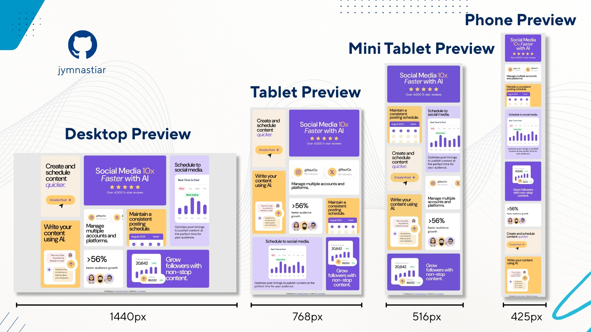

# Frontend Mentor - Bento grid solution

This is a solution to the [Bento grid challenge on Frontend Mentor](https://www.frontendmentor.io/challenges/bento-grid-RMydElrlOj). Frontend Mentor challenges help you improve your coding skills by building realistic projects.

## Table of contents

- [Overview](#overview)
  - [The challenge](#the-challenge)
  - [Screenshot](#screenshot)
  - [Links](#links)
- [My process](#my-process)
  - [Built with](#built-with)
  - [What I learned](#what-i-learned)
  - [Continued development](#continued-development)
  - [Useful resources](#useful-resources)
- [Author](#author)

## Overview

### The challenge

Users should be able to:
- View the optimal layout for the interface depending on their device's screen size

### Screenshot



### Links

- [Solution URL](https://github.com/jymnastiar/Bento-Grid)
- [Live Site URL](https://bento-grid-jym.vercel.app/)

## My process

### Built with

- Semantic HTML5 markup
- CSS custom properties
- Flexbox
- CSS Grid
- Mobile-first workflow
- Media Queries
- [Vercel](https://vercel.com/)
- [Git](https://git-scm.com/)

### What I learned

In this project, I leveled up my CSS game! I finally got the hang of using the `clamp()` function, which is a total lifesaver for creating responsive typography without writing a million media queries. 

I also dove deep into `grid-template-areas`. It honestly made organizing the complex Bento Grid layout feel like a breeze because I could literally "draw" the layout directly in my CSS. Super cool!

```css
h1 {
    font-size: clamp(2rem, 1vw + 2.5rem, 4.5rem);
}

.main {
        grid-template-areas:
            "box-7 box-1 box-1 box-4"
            "box-7 box-2 box-3 box-4"
            "box-8 box-2 box-3 box-4"
            "box-8 box-6 box-5 box-5"
        ;
    }
```

### Continued development

I'm definitely not stopping here! I want to keep sharpening my skills in building fully responsive layouts. Specifically, I want to master the magic of CSS Grid and Flexbox until I can build complex designs with my eyes closed. 

I also want to refine my use of Media Queries and `clamp()` to make my websites feel even smoother across all devices. There's always more to learn, and I'm excited to keep pushing my boundaries in future projects!

### Useful resources

- [Coding2GO](https://www.youtube.com/@coding2go) — This channel helps a lot in mastering CSS.
- [Git Website](https://git-scm.com/) — An excellent resource that helped me truly understand Git. Highly recommended for anyone still learning it.

## Author

- Frontend Mentor - [@jymnastiar](https://www.frontendmentor.io/profile/jymnastiar)